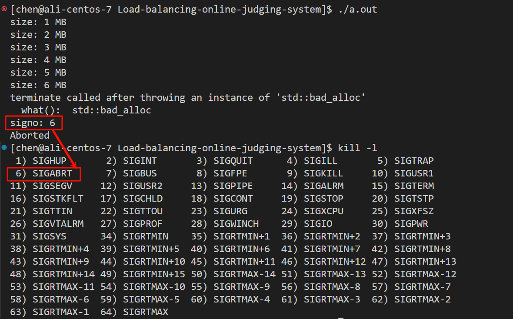
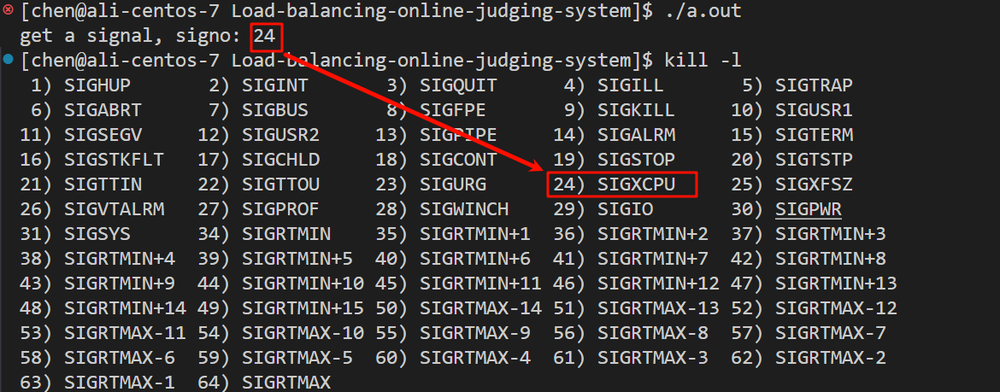
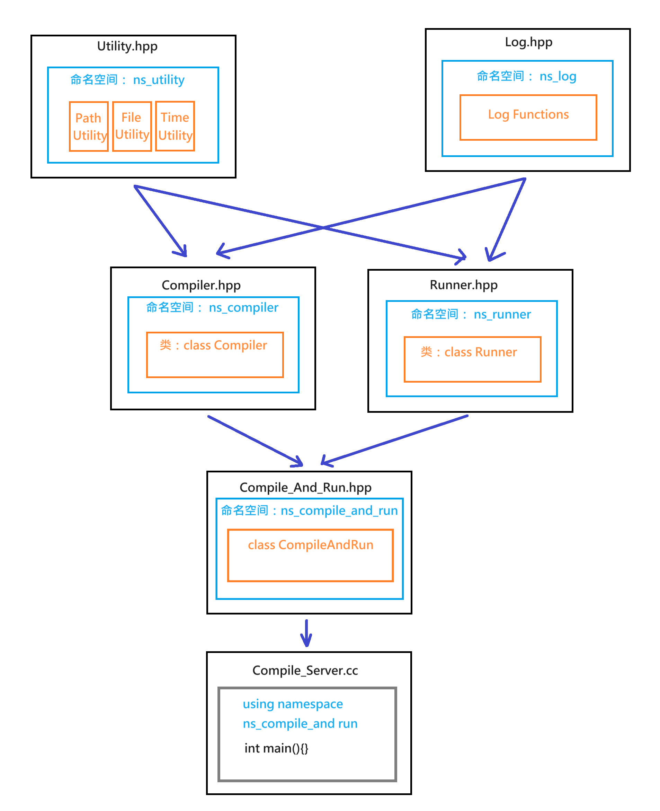
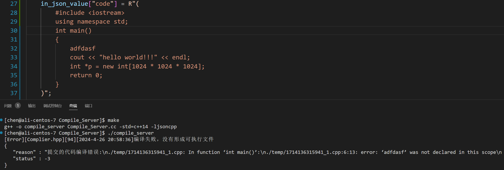
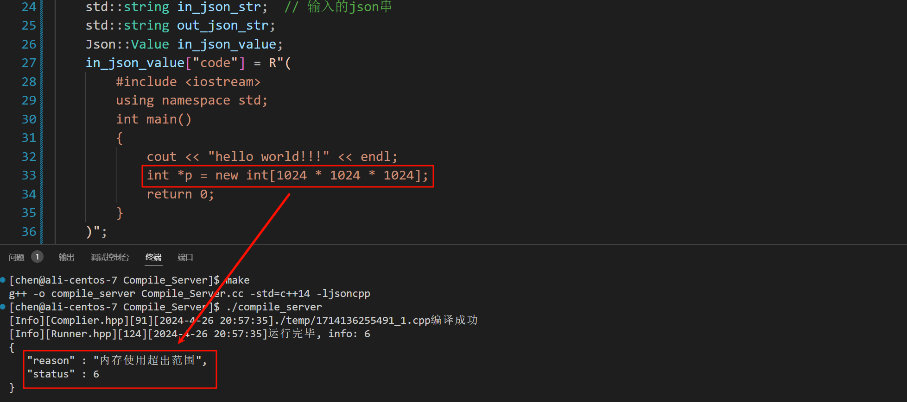
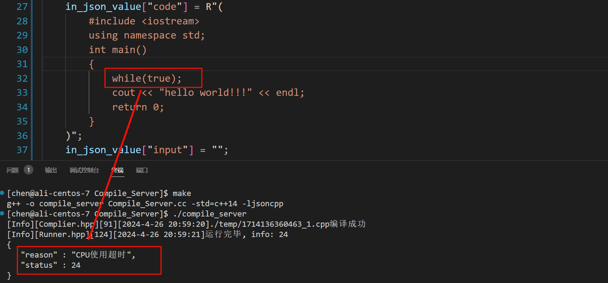
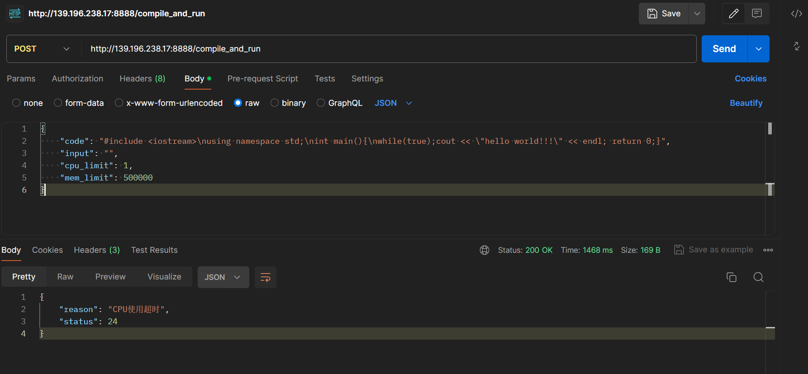

# 二、所用技术与开发环境
## 所用技术
1. C++ STL 标准库
2. Boost 准标准库(字符串切割)
3. cpp-httplib 第三方开源网络库
4. ctemplate 第三方开源前端网页渲染库
5. jsoncpp 第三方开源序列化、反序列化库
6. 负载均衡设计
7. 多进程、多线程
8. MySQL C connect
9. Ace前端在线编辑器(了解)
10. html/css/js/jquery/ajax (了解)

## 开发环境
- CentOS 7 云服务器
- vscode
- DataGrip

# 三、项目宏观结构
我们的项目核心是三个模块：
1. Common : 公共模块
2. Compile_Server : 编译与运行模块
3. OJ_Server : 获取题目列表，查看题目编写题目界面，负载均衡，其他功能

## I. 风格：仿leetcode

只实现类似leetcode 的题目列表+在线编程功能

## II. 结构：Browser-Server模式


## III. 编写思路
1. 先编写compile_server
2. oj_server
3. version1 基于文件版的在线OJ
4. 前端的页面设计
5. version2 基于MySQL 版的在线OJ

<br>
<br>
<br>

# 四、关于Git分支管理

设计了一个 git 分支管理结构和分支命名风格的建议。这套结构以明确的分支策略、基于不同阶段的版本管理和团队协作的流程为基础。 

## Git 分支结构
1. **主分支（main）**
   - 主分支是项目的最终版本，稳定且可发布。
   - 只有经过充分测试和验证的代码才能合并到该分支。
   - 任何发布版本或正式生产环境使用的代码都来自于此。

2. **开发分支（develop）**
   - 用于当前开发阶段的主分支。所有新功能和代码改动最初在这里进行。
   - 测试团队可以在此分支上对代码进行测试和验证。

3. **功能分支（feature/xxx）**
   - 对于每个新功能或组件，创建一个功能分支，遵循 "feature/" 的命名规则。
   - 例如，`feature/compile_server`，`feature/oj_server` 等。
   - 在功能开发完成并经过初步测试后，将其合并到开发分支。

4. **修复分支（fix/xxx）**
   - 当有错误或漏洞需要修复时，创建一个修复分支，遵循 "fix/" 的命名规则。
   - 例如，`fix/bug123`，`fix/compile_error` 等。
   - 完成修复后，合并到开发分支或必要时直接合并到主分支。

5. **发布分支（release/xxx）**
   - 在准备发布新版本时，从开发分支创建一个发布分支，遵循 "release/" 的命名规则。
   - 例如，`release/v1.0`，`release/v2.0` 等。
   - 进行最终测试和bug修复后，合并到主分支并标记发布版本。
   
6. **热修复分支（hotfix/xxx）**
   - 当需要紧急修复生产环境的问题时，创建一个热修复分支，遵循 "hotfix/" 的命名规则。
   - 例如，`hotfix/critical_error`。
   - 完成热修复后，将其合并到主分支，同时也合并到开发分支。

## Git 分支命名风格
- 使用小写字母和连字符分隔单词，确保分支命名简洁易懂。
- 分支类型和特定名称之间用斜杠（/）分隔。
- 避免使用特殊字符和空格。

### 示例
- `main`
- `develop`
- `feature/compile_server`
- `feature/oj_server`
- `fix/compile_bug`
- `release/v1.0`
- `hotfix/critical_issue`

## Commit Message规范
在 Git 中，良好的提交信息（commit message）对于团队协作、代码维护和历史追踪至关重要。规范的提交信息可以使代码库更易于理解，并且更容易查找和定位问题。下面是一些编写提交信息的规范和最佳实践：

### 提交信息的基本结构
1. **简洁的标题行（Summary Line）**
   - 标题行应简洁明了，通常不超过50个字符。
   - 该行用于快速概述此次提交的目的。

2. **空行**
   - 标题行之后应有一个空行，以便于显示和解析。

3. **详细描述（Optional Description）**
   - 如果需要详细描述，可以在空行之后进行详细说明。
   - 此部分可以包含对代码改动的详细解释、背景、原因、相关问题的编号、用例、已知问题等。

### 提交信息实践
1. **简明扼要**
   - 提交信息应直接、简明，避免不必要的冗长。

2. **使用动词开头**
   - 标题行通常使用动词进行动词命令式语气，例如："Fix"、"Add"、"Update"、"Remove" 等。

3. **描述具体的变化**
   - 确保标题行能够反映代码改动的本质，例如："Fix compile error"、"Add user authentication"、"Update readme file"。

4. **关联相关信息**
   - 如果有相关的问题、任务、或用户故事，应该在提交信息中提到，例如："Related to issue #123"。

5. **避免不必要的信息**
   - 避免使用模糊词汇或无关的信息，例如 "Fix stuff"、"Update code"。

### 示例提交信息
```txt
Add user authentication

Implemented user authentication using JWT.
Created a new endpoint for user login.
Updated the database schema to store user tokens.
```

```txt
Fix compile error in compile_server

Resolved a compile-time error caused by a missing include directive.
Tested compile_server and ensured all tests passed.
```

```txt
Update README file with project details

Added project structure and technology stack to README.
Updated instructions for setting up the development environment.
```

### 使用工具验证提交信息
有些开发团队使用 Git 钩子或自动化工具来强制执行提交信息规范。在这种情况下，你可能需要遵循更严格的标准。


# 五、Compiler_Server - 编译服务设计
提供的服务：编译并运行代码，得到格式化的相关的结果：


## 5.1 编译功能 (Compiler.hpp)

## 5.2 日志功能 (Log.hpp)

## 5.3 运行功能 (Runner.hpp)

## 5.4 测试资源限制功能

```cpp
#include <sys/time.h>
#include <sys/resource.h>
#include <iostream>
#include <unistd.h>
#include <signal.h>

void handler(int signo)
{
    std::cout << "signo: " << signo << std::endl;
}

int main()
{
    for(int i = 0; i <= 31; i++)
    {
        signal(i, handler);
    }

    // 限制累计运行时长
    struct rlimit time_limit;
    time_limit.rlim_cur = 1; // 一秒钟
    time_limit.rlim_max = RLIM_INFINITY; 
    setrlimit(RLIMIT_CPU, &time_limit);

    // 限制内存
    struct rlimit mem_limit;
    mem_limit.rlim_cur = 1024 * 1024 * 40;
    mem_limit.rlim_max = RLIM_INFINITY;
    setrlimit(RLIMIT_AS, &mem_limit);


    int count = 0;
    while(1)
    {
        int *p = new int[1024 * 1024];
        count++;
        std::cout << "size: " << count << " MB" << std::endl;
        sleep(1);
    }
    return 0;
}
```

设置资源限制（包括内存和cpu时间）的系统调用叫setrlimit，它的函数原型如下：
```cpp
int setrlimit(int resource, const struct rlimit *rlim);
```
它的第一个参数是我们要设置限制的资源类型：
- 使用RLIMIT_AS来限制进程虚拟内存(地址空间)的最大字节数
- 使用RLIMIT_CPU来限制CPU时间限制(以秒为单位)。

而第二个参数需要一个rlimit结构体，我们需要设置好结构体对象再传给该函数，结构体声明如下：
```cpp
struct rlimit {
   rlim_t rlim_cur;  /* Soft limit */
   rlim_t rlim_max;  /* Hard limit (ceiling for rlim_cur) */
};
```

说明一下：
- 软限制是内核对对应资源实施的值。
- 硬限制相当于软限制的上限
   - 非特权进程只能将其软限制设置为0到硬限制之间的值，并(不可逆转地)降低其硬限制。
   - 特权进程(在Linux下:具有CAP_SYS_RESOURCE能力的进程)可以对任何一个限制值进行任意修改。值RLIM_INFINITY表示对资源没有限制(无论是在getrlimit()返回的结构中，还是在传递给setrlimit()的结构中)。


测试结果：
1. 内存申请失败，进程收到6号SIGABRT信号：
2. CPU使用超时，收到24号SIGXCPU信号：


## 5.5 编译并运行 (Compile_And_Run.hpp)

temp:
命名空间： ns_compiler,  类：class Compiler
命名空间： ns_runner  类：class Runner
命名空间： ns_log
命名空间： ns_utility,  类：class PathUtility FileUtility TimeUtility

>[!Tip] 我们项目目前的结构：
>


### 本地测试
我们可以对“CompileAndRun”进行本地测试，给run函数传递一个json串，包括试运行的代码，然后看看返回的json串是否符合预期。

预期：
1. 能否返回各种错误信息
2. 能够在temp目录下，生成带有编译错误、标准输出、标准错误的文件，且文件名唯一。

```cpp
#include "Compile_And_Run.hpp"
using namespace ns_compile_and_run;

int main()
{
    // 通过http 让client 给我们上传一个json数据

    std::string in_json_str;  // 输入的json串
    std::string out_json_str;
    Json::Value in_json_value;
    in_json_value["code"] = R"(
        #include <iostream>
        using namespace std;
        int main()
        {
            while(true);
            cout << "hello world!!!" << endl; 
            return 0;
        }
    )";
    in_json_value["input"] = "";
    in_json_value["cpu_limit"] = 1;
    in_json_value["mem_limit"] = 10240 * 30;

    Json::FastWriter writer;
    in_json_str = writer.write(in_json_value);
    
    CompileAndRun::Start(in_json_str, &out_json_str);

    std::cout << out_json_str << std::endl;
    return 0;
}
```

本地测试运行结果：
1. 编译错误：
2. 运行错误 - 内存超出限制：
3. 运行错误 - 时间超出限制：


点击[这里](#section1)跳转如何安装jsoncpp


### 包装成网络服务，进行网络测试

1. 让我们的项目接入cpp-httplib开源第三方库，它是一个***阻塞式多线程的一个网络http库***
2. cpp-httplib是**header-only**的，所以只需要将`.h`拷贝到项目中，即可直接使用，点击[这里](#section2)跳转到如何安装cpp-httplib。

3. 编写Compile_Server.cc，引入httplib头文件：
```cpp
#include "Compile_And_Run.hpp"
#include "../Common/httplib.h"

using namespace ns_compile_and_run;
using namespace httplib;

void Usage(const char* proc)
{
    std::cerr << "Usage: " << "\n\t" << proc << " server_port" << std::endl;
}

int main(int argc, char* argv[])
{
    if(argc != 2)
    {
        Usage(argv[0]);
        return 1;
    }


    // using Handler = std::function<void(const Request &, Response &)>;
    Server svr;

    svr.Get("/hello", [](const Request &req, Response &resp){
        // 用来进行基本测试
        resp.set_content("hello httplib, 你好httplib!", "text/plain;charset=utf-8");
    });

    svr.Post("/compile_and_run", [](const Request &req, Response &resp){
        // 用户请求的服务正文是一个json串
        std::string in_json_str = req.body;
        std::string out_json_str;
        if(!in_json_str.empty())
        {
            CompileAndRun::Start(in_json_str, &out_json_str);
            resp.set_content(out_json_str, "application/json;charset=utf-8");
        }
    });

    svr.set_base_dir("./wwwroot");
    svr.listen("0.0.0.0", atoi(argv[1]));

    return 0;
}
```

>说明一下：
1. **svr.Get("/hello", lambda表达式)**

   这个调用设置了当服务器接收到一个 GET 请求到 "/hello" 路径时应该执行的回调函数。这里的回调函数非常简单，它只是设置响应的内容为 "hello httplib, 你好httplib!"，并设置内容类型为 "text/plain;charset=utf-8"。

2. **svr.Post("/compile_and_run", lambda表达式)**

   这个调用设置了当服务器接收到一个 POST 请求到 "/compile_and_run" 路径时应该执行的回调函数。这个回调函数会获取请求的主体（body）内容，它应该是一个 JSON 字符串。然后，它调用 `CompileAndRun::Start` 函数让服务器对post过来的JSON串中的代码编译处理后，将运行结果作为 JSON串返回给客户端。响应的内容类型被设置为 "application/json;charset=utf-8"。
   我们使用PostMan进行测试，可以通过[PostMan官网](https://web.postman.com/)下载安装。
   
   - POST一个json串可以返回它对应的json串：
   

   - 可以在终端中看到服务器打出的日志信息，服务器响应了我们的请求：

3. **svr.set_base_dir("./wwwroot")**

   这个调用设置了服务器的基础目录为 "./wwwroot"。这意味着，当客户端请求一个静态文件（例如一个图片或 CSS 文件）时，服务器会在这个目录下查找这个文件：

4. **svr.listen("0.0.0.0", atoi(argv[1]))**

   这个调用启动服务器并使其监听传入的连接。`"0.0.0.0"` 表示服务器应该监听所有可用的网络接口。`atoi(argv[1])` 将命令行参数 `argv[1]` 转换为整数，这个整数表示服务器应该监听的端口号。


<br>
<br>
<br>
<br>
<br>
<br>

# Final. 所有备注

## 安装jsoncpp

<a id="section1"></a>

```bash
[chen@ali-centos-7 Load-balancing-online-judging-system]$ sudo yum install -y jsoncpp-devel
Loaded plugins: fastestmirror
Loading mirror speeds from cached hostfile
 * centos-sclo-rh: mirrors.163.com
 * centos-sclo-sclo: mirrors.nju.edu.cn
Package jsoncpp-devel-0.10.5-2.el7.x86_64 already installed and latest version
Nothing to do
[chen@ali-centos-7 Load-balancing-online-judging-system]$ 
```


## 安装cpp-httplib：header-only
<a id="section2"></a>

cpp-httplib gitee链接：https://gitee.com/yuanfeng1897/cpp-httplib?_from=gitee_search

v0.7.15版本链接： https://gitee.com/yuanfeng1897/cpp-httplib/tree/v0.7.15

说明：
1. 接入cpp-httplib，只需要将.h拷贝到你的项目中，即可直接使用
2. 最新的cpp-httplib在使用的时候，如果gcc不是特别新的话有可能会有运行时错误的问题
   - 建议：cpp-httplib 0.7.15
   - 下载zip安装包，上传到服务器即可


```cpp
// 使用样例:
#include "httplib.h"
int main()
{
   httplib::Server svr;
   svr.Get("/hi", [](const httplib::Request &req, httplib::Response &rsp){
   rsp.set_content("你好,世界!", "text/plain; charset=utf-8");
   });
   svr.listen("0.0.0.0", 8080);
   return 0;
}
// 更多的细节可以看gitee上面的使用手册
```
