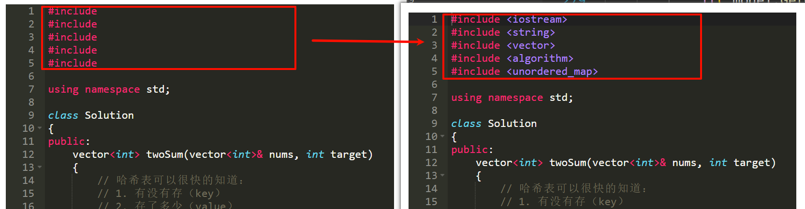

# 一、演示项目
**项目源码链接：** https://github.com/NQ-lovecpp/Load-balancing-online-judging-system

**前端网页：**


# 二、所用技术与开发环境
## 所用技术
1. C++ STL 标准库
2. Boost 准标准库(我们使用了其中的字符串切割方法)
3. cpp-httplib 第三方开源网络库
4. ctemplate 第三方(Google)开源前端网页渲染库
5. jsoncpp 第三方开源序列化、反序列化库
6. 负载均衡设计
7. 多进程、多线程
8. MySQL C connect
9. Ace前端在线编辑器
10. html/css/js/jquery/ajax

> [!Quote] 说明一下项目中使用到的多进程和多线程：
>
>**1. 多线程体现在我们使用的第三方库中使用了线程池接受并发请求：**
>
>- `cpp-httplib`是一个轻量级且高效的 C++ HTTP/HTTPS 客户端和服务器库，由 Hideaki Sone（yhirose）开发， 它提供一种简单易用的方式，在 C++ 应用程序中实现 HTTP 和 HTTPS 功能。
>
>- `cpp-httplib`采用了**多线程处理客户端的并发请求**，从而提高服务器性能。
> 
>**2. 多进程体现在我们的后端编译服务采用创建子进程的方式编译代码，从而不影响主执行**


## 开发环境
- CentOS 7 云服务器
- vscode
- XShell
- DataGrip

# 三、项目宏观结构
我们的项目核心是三个模块：
1. Common : 公用代码和工具
2. Compile_Server : 用户代码的编译与运行模块
3. OJ_Server : 获取题目列表，查看题目编写题目界面，负载均衡，以及其他功能

## I. 风格：仿leetcode

目前只实现类似 `leetcode` 的**题目列表+在线编程功能**

## II. 结构：Browser-Server模式

>Browser-Server（B/S）模式，也被称为客户端-服务器（Client-Server）模式，是一种软件架构模式，常用于Web应用程序的开发和部署。在这种模式下，客户端通常是浏览器，服务器是后端应用程序或数据库服务器。


## III. 编写思路
1. 先编写compile_server
2. oj_server
3. version1 - 基于`文件`题库的在线OJ
4. 前端的页面设计
5. version2 - 基于`MySQL`题库的在线OJ
 

# 四、关于Git分支管理

我们设计了一个 git 分支管理结构和分支命名风格的建议。这套结构以明确的分支策略、基于不同阶段的版本管理和团队协作的流程为基础。**我们同时使用`VSCode`中的集成的Git和命令行下的Git共同完成版本控制**。

## Git 分支结构
1. **主分支（main）**
   - 主分支是项目的最终版本，稳定且可发布。
   - 只有经过充分测试和验证的代码才能合并到该分支。
   - 任何发布版本或正式生产环境使用的代码都来自于此。

2. **开发分支（develop）**
   - 用于当前开发阶段的主分支。所有新功能和代码改动最初在这里进行。
   - 测试团队可以在此分支上对代码进行测试和验证。

3. **功能分支（feature/xxx）**
   - 对于每个新功能或组件，创建一个功能分支，遵循 "feature/" 的命名规则。
   - 例如，`feature/compile_server`，`feature/oj_server` 等。
   - 在功能开发完成并经过初步测试后，将其合并到开发分支。

4. **修复分支（fix/xxx）**
   - 当有错误或漏洞需要修复时，创建一个修复分支，遵循 "fix/" 的命名规则。
   - 例如，`fix/bug123`，`fix/compile_error` 等。
   - 完成修复后，合并到开发分支或必要时直接合并到主分支。

5. **发布分支（release/xxx）**
   - 在准备发布新版本时，从开发分支创建一个发布分支，遵循 "release/" 的命名规则。
   - 例如，`release/v1.0`，`release/v2.0` 等。
   - 进行最终测试和bug修复后，合并到主分支并标记发布版本。
   
6. **热修复分支（hotfix/xxx）**
   - 当需要紧急修复生产环境的问题时，创建一个热修复分支，遵循 "hotfix/" 的命名规则。
   - 例如，`hotfix/critical_error`。
   - 完成热修复后，将其合并到主分支，同时也合并到开发分支。

## Git 分支命名风格
- 使用小写字母和连字符分隔单词，确保分支命名简洁易懂。
- 分支类型和特定名称之间用斜杠（/）分隔。
- 避免使用特殊字符和空格。

### 示例
- `main`
- `develop`
- `feature/compile_server`
- `feature/oj_server`
- `fix/compile_bug`
- `release/v1.0`
- `hotfix/critical_issue`

## Commit Message规范
在 Git 中，良好的提交信息（commit message）对于团队协作、代码维护和历史追踪至关重要。规范的提交信息可以使代码库更易于理解，并且更容易查找和定位问题。下面是一些编写提交信息的规范和最佳实践：

### 提交信息的基本结构
1. **简洁的标题行（Summary Line）**
   - 标题行应简洁明了，通常不超过50个字符。
   - 该行用于快速概述此次提交的目的。

2. **空行**
   - 标题行之后应有一个空行，以便于显示和解析。

3. **详细描述（Optional Description）**
   - 如果需要详细描述，可以在空行之后进行详细说明。
   - 此部分可以包含对代码改动的详细解释、背景、原因、相关问题的编号、用例、已知问题等。

### 提交信息实践
1. **简明扼要**
   - 提交信息应直接、简明，避免不必要的冗长。

2. **使用动词开头**
   - 标题行通常使用动词进行动词命令式语气，例如："Fix"、"Add"、"Update"、"Remove" 等。

3. **描述具体的变化**
   - 确保标题行能够反映代码改动的本质，例如："Fix compile error"、"Add user authentication"、"Update readme file"。

4. **关联相关信息**
   - 如果有相关的问题、任务、或用户故事，应该在提交信息中提到，例如："Related to issue #123"。

5. **避免不必要的信息**
   - 避免使用模糊词汇或无关的信息，例如 "Fix stuff"、"Update code"。

### 示例提交信息
```txt
Add user authentication

Implemented user authentication using JWT.
Created a new endpoint for user login.
Updated the database schema to store user tokens.
```

```txt
Fix compile error in compile_server

Resolved a compile-time error caused by a missing include directive.
Tested compile_server and ensured all tests passed.
```

```txt
Update README file with project details

Added project structure and technology stack to README.
Updated instructions for setting up the development environment.
```

### 使用工具验证提交信息
有些开发团队使用 Git 钩子或自动化工具来强制执行提交信息规范。在这种情况下，你可能需要遵循更严格的标准。

## VSCode中的Git可视化插件 - Git Graph

Git Graph 是 VSCode 的一款非常好用的插件，它用于可视化 Git 仓库的历史记录和操作。它提供了一个直观的界面来查看分支、提交和其他相关信息，帮助开发者更好地管理和了解他们的 Git 仓库的历史提交：


# 五、Compiler_Server - 编译服务设计
>`Compiler_Server` 提供的服务：编译并运行代码，得到格式化的相关的结果。
>
>很明显，是存在两个步骤的：先编译，后运行。我们先分别编写编译模块和运行模块，最后再将它们拼接起来。

## 5.1 编译功能 (Compiler.hpp)
一个C/C++程序源文件，需要经过gcc/g++工具进行预处理、编译、汇编、链接最终形成可执行文件。

平时，我们将一个源文件编译形成可执行文件只需要在bash下键入命令`gcc/g++ -o target main.cpp` 一步到位即可。但是现在我们需要在程序中实现这个功能，就需要用到操作系统的系统调用接口：`exec*` 系列系统调用进行**进程程序替换**。

>我们考虑以下问题：
>1. 待编译的源文件从哪里来？Runner模块会传递文件名，根据文件名可以在temp文件夹中找到用户提交的代码，用户代码由Compile_And_Run模块从传入的json串中获得。
>2. 其次编译可能出现报错，失败信息如何得知？gcc/g++程序的报错默认是输出到stderr文件中的，那么我们可以将stderr文件重定向到指定目录（temp）下的 `.compile_error` 文件中。
>3. 如何知道编译是否成功？看是否形成可执行文件 `.out`。


### 拼接成目标路径的方法 (Utility.hpp)
因为我们希望用户代码及其编译结果和运行结果都存放在temp文件夹下，所以我们可以设计一下拼接成文件完整路径的方法，定义在`PathUtility类`中，它所提供的方法都设置为public的静态方法，供外部直接调用。
```cpp
const std::string temp_path = "./temp/";
class PathUtility
{
private:
   
public:
   PathUtility() {}
   ~PathUtility() {}

   // --- 编译时需要有的临时文件 ---
   static std::string AddSuffix(const std::string &file_name, const std::string &suffix)
   {
      std::string path_name = temp_path;
      path_name += file_name;
      path_name += suffix;
      return path_name;
   }

   // 构建源代码文件的完整路径名（带后缀）
   static std::string Src(const std::string &file_name)
   {
      return AddSuffix(file_name, ".cpp");
   }

   // 构建可执行文件的完整路径名（带后缀）
   static std::string Exe(const std::string &file_name)
   {
      return AddSuffix(file_name, ".out");
   }

   // 构建编译错误的完整路径名（带后缀）
   static std::string CompilerError(const std::string &file_name)
   {
      return AddSuffix(file_name, ".compile_error");
   }


   // --- 运行时需要的临时文件 ---

   // 构建程序对应标准输入文件的完整路径（带后缀）
   static std::string Stdin(const std::string &file_name)
   {
      return AddSuffix(file_name, ".stdin");
   }

   // 构建程序对应标准输入文件的完整路径（带后缀）
   static std::string Stdout(const std::string &file_name)
   {
      return AddSuffix(file_name, ".stdout");
   }

   // 构建程序对应标准输入文件的完整路径（带后缀）
   static std::string Stderr(const std::string &file_name)
   {
      return AddSuffix(file_name, ".stderr");
   }
};
```

### 获取秒级时间戳并转换为"时:分:秒" (Utility.hpp)
这个静态方法是为了下面的日志功能做铺垫，因为我们希望打印出来的日志能够显示时间。
```cpp
static std::string GetTimeStamp()
{
   time_t currtime = time(nullptr);
   struct tm *curr = localtime(&currtime);
   char time_buffer[128];
   snprintf(time_buffer, sizeof(time_buffer), "%d-%d-%d %d:%d:%d", curr->tm_year + 1900, curr->tm_mon + 1, curr->tm_mday, curr->tm_hour, curr->tm_min, curr->tm_sec);
   return time_buffer;
}
```

>说明一下：
>- localtime是c语言提供的可以将时间转化为"时分秒"的函数，定义在`<ctime>`中
>- struct tm的定义如下：
>   ```cpp
>   struct tm {
>      int tm_sec;         /* seconds */
>      int tm_min;         /* minutes */
>      int tm_hour;        /* hours */
>      int tm_mday;        /* day of the month */
>      int tm_mon;         /* month */
>      int tm_year;        /* year */
>      int tm_wday;        /* day of the week */
>      int tm_yday;        /* day in the year */
>      int tm_isdst;       /* daylight saving time */
>   };
>   ```
>
>- 注意`tm_year`是从1900年开始计算的，记得要加上1900才能打印出当前年份

### 开放式日志接口 (Log.hpp)
实现一个简单版本的日志接口，可以像cout一样使用它：
```cpp
// 日志等级
enum LogLevel
{
   Debug = 0,
   Info,
   Warning,
   Error,
   Fatal
};

enum
{
   Screen = 10,
   OneFile,
   ClassFile
};

const int defaultstyle = Screen;
const std::string default_filename = "log.";
const std::string logdir = "log";

std::string LevelToString(int level)
{
   switch (level)
   {
   case Debug:
      return "Debug";
   case Info:
      return "Info";
   case Warning:
      return "Warning";
   case Error:
      return "Error";
   case Fatal:
      return "Fatal";

   default:
      return "Unknown";
   }
}

inline std::ostream& Log(const std::string& level, const std::string& file_name, int line)
{
   // 添加日志等级
   std::string message = "[";
   message += level;
   message += "]";

   // 添加报错文件名称
   message += "[";
   message += file_name;
   message += "]";

   // 添加报错行
   message += "[";
   message += std::to_string(line);
   message += "]";

   // 日志时间戳
   message += "[";
   message += TimeUtility::GetTimeStamp();
   message += "]";

   // cout 本质 内部是包含缓冲区的
   std::cout << message; //不要endl进行刷新

   return std::cout;
}

#define LOG(level) Log(#level, __FILE__, __LINE__)
```

### 编译服务主体 (Compiler.hpp)

```cpp
static bool Compile(const std::string &file_name)
{
   pid_t pid = fork();
   if(pid < 0)
   {
         // 创建子进程失败
         LOG(Error) << "fork错误，创建子进程失败" << "\n";
         return false;
   }
   else if(pid == 0)
   {
         // 子进程：调用编译器，完成对代码的编译

         // 没有就创建+只写
         umask(0);
         int _stderr = open(PathUtility::CompilerError(file_name).c_str(), O_CREAT | O_WRONLY, 0644);
         if(_stderr < 0)
         {
            LOG(Warning) << "没有形成stderr文件" << "\n";
            exit(1);
         }

         dup2(_stderr, stderr->_fileno); // 重定向到_stderr文件

         // exec系统调用不会影响进程已经打开的文件（不影响文件描述符表）
         // g++ target -o target src -std=c++11
         execlp("g++", "g++", "-o", PathUtility::Exe(file_name).c_str(), \
         PathUtility::Src(file_name).c_str(), "-std=c++11", "-D", "COMPILER_ONLINE", nullptr); // 这里的nullptr表示结尾

         LOG(Error) << "g++未启动，可能是参数错误" << "\n";;
         exit(1); // 程序替换错误直接终止子进程
   }
   else
   {
         // 父进程
         // 阻塞等待子进程   
         waitpid(pid, nullptr, 0);

         // 编译是否成功就看：是否形成了同名可执行程序
         if(FileUtility::IsFileExists(PathUtility::Exe(file_name)))
         {
            LOG(Info) << PathUtility::Src(file_name) << "编译成功" << "\n";
            return true;
         }
         LOG(Error) << "编译失败，没有形成可执行文件" << "\n";
         return false;
   }
}
```

>需要注意的是：调用dup2系统调用的时机在调用execlp之前，也就是说我们在程序替换前完成了重定向，而重定向不会影响进程已经打开的文件，也就是不影响子进程现存的文件描述符表，那么g++编译的报错信息就合乎预期地打印到了我们重定向的文件中了。

## 5.2 运行功能 (Runner.hpp)
运行功能的本质是创建子进程，让子进程去执行可执行文件：
- 在创建子进程时，使用了 `fork()` 来创建子进程。如果 `fork()` 返回的值大于零，表示这是父进程。
- 父进程在运行完子进程后，通过 `waitpid()` 等待子进程结束，并获取其退出状态。
  - `waitpid()` 的第二个参数 `status` 会保存子进程的退出状态，退出状态在正常和被信号所杀的情况下有所不同：
  - `status & 0x7F` 这个操作可以获得子进程的退出信号，如果这个值不为零，说明子进程异常退出。
  - 如果子进程正常结束，其退出码通常可以通过 `WIFEXITED(status)` 检查，然后通过 `WEXITSTATUS(status)` 获取实际的退出码。我们主要是判断信号，所以使用 `status & 0x7F` 来判断子进程是否因信号异常退出，因为十六进制`7F`按位与上状态码，刚好是退出信号：


```cpp
class Runner
{
public:
   Runner() {}
   ~Runner() {}

   // 设置执行用户代码的子进程占用空间和cpu时间的方法
   static void SetProcLimit(int _cpu, int _memory)
   {
      // 限制累计运行时长
      struct rlimit time_rlimit;
      time_rlimit.rlim_cur = _cpu;
      time_rlimit.rlim_max = RLIM_INFINITY; 
      setrlimit(RLIMIT_CPU, &time_rlimit);

      // 限制内存
      struct rlimit mem_rlimit;
      mem_rlimit.rlim_cur = _memory * 1024; // 转化为KB
      mem_rlimit.rlim_max = RLIM_INFINITY;
      setrlimit(RLIMIT_AS, &mem_rlimit);
   }

   static int Run(const std::string &file_name, int cpu_limit, int mem_limit)
   {
      std::string _execute = PathUtility::Exe(file_name);
      std::string _stdin   = PathUtility::Stdin(file_name);
      std::string _stdout  = PathUtility::Stdout(file_name);
      std::string _stderr  = PathUtility::Stderr(file_name);

      umask(0);
      // 父进程打开的文件，fork之后子进程也是打开的！
      int _stdin_fd = open(_stdin.c_str(), O_CREAT | O_RDONLY, 0644);
      int _stdout_fd = open(_stdout.c_str(), O_CREAT | O_WRONLY, 0644);
      int _stderr_fd = open(_stderr.c_str(), O_CREAT | O_WRONLY, 0644);

      if(_stdin_fd < 0 || _stdout_fd < 0 || _stderr_fd < 0)
      {
         LOG(Error) << "运行时打开标准文件失败" << "\n";
         return -1; // 打开文件失败
      }

      // 创建子进程
      pid_t pid = fork();
      if(pid < 0)
      {
         LOG(Error) << "运行时创建子进程失败" << "\n";
         close(_stdin_fd);
         close(_stdout_fd);
         close(_stderr_fd); 
         return -2; // 创建子进程失败
      }
      else if(pid == 0)
      {
         // 把0 1 2重定向到文件中去
         dup2(_stdin_fd, stdin->_fileno);
         dup2(_stdout_fd, stdout->_fileno);
         dup2(_stderr_fd, stderr->_fileno);

         SetProcLimit(cpu_limit, mem_limit);

         // 执行程序
         execl(_execute.c_str()/*我要执行谁*/, _execute.c_str()/*命令行参数*/, nullptr);
         exit(1);
      }
      else
      {// 父进程
         close(_stdin_fd);
         close(_stdout_fd);
         close(_stderr_fd);

         int status = 0;
         waitpid(pid, &status, 0);
         LOG(Info) << "运行完毕, info: " << (status & 0x7F) << "\n"; 
         return status & 0x7F; // 返回错误信号值
      }
   }
};
```
参数说明：
   - `cpu_limit`: 运行时cpu时间限制
   - `mem_limit`: 运行时内存限制
   
返回值说明：
   - **返回值 > 0**：当返回值大于零时，说明子进程因接收到信号而退出。返回的值是对应的信号编号。这通常表明程序在运行期间出现了异常，例如内存访问违规、除零错误、超时等。
   - **返回值 = 0**：当返回值等于零时，说明子进程正常运行完毕。stdout文件存放在在temp目录下中。这意味着用户的代码正确执行，未出现异常。==**需要注意的是，这不代表代码的输出是否正确并满足测试用例要求，只表示代码运行完毕，没有异常**==。
   * **返回值 < 0**：服务器内部错误，我们不希望暴露给用户错误的具体信息，但是我们服务器会打印error日志，此时返回值的具体含义是：
      - -1: 表示在运行时打开标准输入、输出、错误文件失败。
      - -2: 表示在运行时创建子进程失败。

对三个标准文件中的内容做说明：
   - 标准输入: 我们暂时不处理，后期可以增加用户输入功能
   - 标准输出: 程序运行完成，输出结果就在里面
   - 标准错误: 运行时错误信息

## 5.3 测试资源限制功能 (test_resource_limitation.cc)

一般的OJ判题系统（如leetcode）会限制用户提交代码编译后运行时使用的cpu时间和内存，我们想测试一下在Linux服务器下如何实现这个功能：
```cpp
#include <sys/time.h>
#include <sys/resource.h>
#include <iostream>
#include <unistd.h>
#include <signal.h>

void handler(int signo)
{
    std::cout << "signo: " << signo << std::endl;
}

int main()
{
    for(int i = 0; i <= 31; i++)
    {
        signal(i, handler);
    }

    // 限制累计运行时长
    struct rlimit time_limit;
    time_limit.rlim_cur = 1; // 一秒钟
    time_limit.rlim_max = RLIM_INFINITY; 
    setrlimit(RLIMIT_CPU, &time_limit);

    // 限制内存
    struct rlimit mem_limit;
    mem_limit.rlim_cur = 1024 * 1024 * 40;
    mem_limit.rlim_max = RLIM_INFINITY;
    setrlimit(RLIMIT_AS, &mem_limit);


    int count = 0;
    while(1)
    {
        int *p = new int[1024 * 1024];
        count++;
        std::cout << "size: " << count << " MB" << std::endl;
        sleep(1);
    }
    return 0;
}
```

设置资源限制（包括内存和cpu时间）的系统调用叫setrlimit，它的函数原型如下：
```cpp
int setrlimit(int resource, const struct rlimit *rlim);
```
它的第一个参数是我们要设置限制的资源类型：
- 使用RLIMIT_AS来限制进程虚拟内存(地址空间)的最大字节数
- 使用RLIMIT_CPU来限制CPU时间限制(以秒为单位)。

而第二个参数需要一个rlimit结构体，我们需要设置好结构体对象再传给该函数，结构体声明如下：
```cpp
struct rlimit {
   rlim_t rlim_cur;  /* Soft limit */
   rlim_t rlim_max;  /* Hard limit (ceiling for rlim_cur) */
};
```

说明一下：
- 软限制是内核对对应资源实施的值。
- 硬限制相当于软限制的上限
   - 非特权进程只能将其软限制设置为0到硬限制之间的值，并(不可逆转地)降低其硬限制。
   - 特权进程(在Linux下:具有CAP_SYS_RESOURCE能力的进程)可以对任何一个限制值进行任意修改。值RLIM_INFINITY表示对资源没有限制(无论是在getrlimit()返回的结构中，还是在传递给setrlimit()的结构中)。


测试结果：
1. 内存申请失败，进程收到6号`SIGABRT`信号：
2. CPU使用超时，收到24号`SIGXCPU`信号：


## 5.4 "编译并运行"模块 (Compile_And_Run.hpp)

上面将编译和运行模块分开了，正常流程则是先编译后运行。那么我们需要将这两个流程整合起来实现编译运行模块的后端工作。

想要编译，那么我们就需要源文件，源文件从哪里来？通过网络发送而来（来源其实是我们之后即将编写的OJ_Server服务器）。所以我们编译服务器收到的从网络发来的数据是一个json串，我们编译服务器对其进行反序列化后得到的数据写入源文件中，交给编译功能编译后形成可执行文件然后交给运行功能运行，最后整合结果也向对方返回结果json串完成工作。

>我们对Compile_Server服务器从网络中收发的json串做一个规定：

- Compile_Server收到的：
   - code：     用户提交的代码
   - input:     用户给自己提交的代码对应的输入，不做处理 - 后期扩展
   - cpu_limit: 时间要求
   - mem_limit: 空间要求

- Compile_Server返回的：
   - 必填：
      - status: 状态码
      - reason: 请求结果
   - 选填：
      - stdout: 我的程序运行完的结果
      - stderr: 我的程序运行完的错误结果

>编译服务收发的json串示范：
```json
in_json: {
   "code": "#include...", 
   "input": "",
   "cpu_limit":1, 
   "mem_limit":10240
}

out_json: {
   "status":"0",
   "reason":"",
   "stdout":"",
   "stderr":""
}
```
>注意:cpp的json库在linux下需要`sudo yum install jsoncpp-devel`安装json开发库，并且在编译选项中加上`-ljsoncpp`方可编译。
点击[这里](#section1)跳转如何安装jsoncpp。

### 生成唯一文件名 (Utility.hpp)

当一份用户提交代码后，我们为其生成的各种文件的前缀（包括`.cpp`、`.compile_error`、`.stderr`、...）需要具有唯一性。名字生成的唯一性我们可以利用 **毫秒级时间戳 + 原子性的增长计数器** 实现。

> 如何实现？
1. 毫秒级时间戳可以利用`gettimeofday`函数调用实现（返回的结构体存在微秒级的属性，简单转换就可以得到微秒）
   ```cpp
   // 获取毫秒级时间戳
   static std::string GetTimeMs()
   {
      struct timeval _time;
      gettimeofday(&_time, nullptr);
      return std::to_string(_time.tv_sec * 1000 + _time.tv_usec / 1000);
   }
   ```
2. 原子性的增长计数器（同一时刻不同执行流调用-利用static的变量）利用C++11的原子性操作库中的`atomic_uint`即可实现
   ```cpp
   static std::string GetUniqueFileName()
   {
      static std::atomic_uint id(0);
      id++;
      std::string ms = TimeUtility::GetTimeMs();

      // 通过毫秒级时间戳+原子性递增的唯一值
      std::string uniq_id = std::to_string(id);
      return ms + "_" + uniq_id;
   }
   ```


> 为什么要这样做？
1. **用毫秒级时间戳是为了一定程度上保证文件名的随机性。**
   
   但是如果仅仅使用毫秒级时间戳来命名文件，可能会碰到极端情况：服务器在一毫秒内被并发地多次请求编译时，生成的文件名都是一样的。

2. **原子性递增的计数器可以保证程序从开始运行到结束的序号不重复。**

   这里采用原子性变量的原因是为了保证线程安全，因为会存在多个并发的Post请求（请求编译服务），也就存在多条执行流（多个线程）去递增同一个计数器（这个计数器是static的，整个程序里只存在一份），如果不加锁会存在线程安全问题。

<br>

**效果：**


### 写文件/读文件 (Utility.hpp)

对收到的json串反序列化得到数据后，我们需要将code部分写入`.cpp`源文件中去。 写入文件很简单（利用C++的`<ofstream>`简单IO即可），但是需要注意，之后此模块的功能是被打包为网络服务的。也就是说可能同时出现了很多用户提交的代码。如果此时名字冲突就会发生问题，不同用户之间执行的不同题或者编程内容就会出现问题，因此需要使用上面生成唯一文件名的方法。

```cpp
static bool WriteFile(const std::string &target_path, const std::string &content)
{
   std::ofstream out(target_path, std::ios::binary);
   if(!out.is_open())
   {
         return false;
   }

   out.write(content.c_str(), content.size());
   out.close();
   return true;
}

// 从指定文件读取文件
static bool ReadFile(const std::string &target_path, std::string *content, bool keep = false)
{
   std::ifstream in(target_path);
   if(!in.is_open())
   {
         std::cerr << "打开: " << target_path << "文件失败!" << std::endl;
         return false;
   }

   std::string line;
   while(std::getline(in, line))
   {
         (*content) += line;
         (*content) += (keep ? "\n" : "");
   }

   return true;
}
```
参数说明：
1. target_path 文件路径
2. content 文件内容（输出型参数）
3. keep 是否保留文件中的"\n"


### 统一处理错误码

对我们关心的错误（比如内存超限和cpu超时）进行过滤：
```cpp
static std::string CodeToDetail(int code, const std::string &file_name)
{
   std::string detail;
   switch (code)
   {
   case -1:
         detail = "提交的代码是空的";
         break;
   case -2:
         detail = "未知错误";
         break;
   case -3:
         detail = "提交的代码编译错误:\n";
         detail += FileUtility::ReadFile(PathUtility::CompilerError(file_name), &detail, true);
         break;
   case 0:
         detail = "编译运行成功";
         break;
   case SIGABRT: // 6
         detail = "内存使用超出范围";
         break;
   case SIGXCPU: // 24
         detail = "CPU使用超时";
         break;
   default:
         detail = "未知：" + std::to_string(code);
         break;
   }

   return detail;
}
```

### 开始编译 (Start方法)

我们的`Compile_And_Run.hpp`主要就包含了Start函数，它完成了编译并运行，一遍后面的主文件`Compile_Server.cc`调用Start方法。

```cpp
static void Start(const std::string &in_json, std::string *out_json)
{
   Json::Value in_value;
   Json::Reader reader;
   reader.parse(in_json, in_value); // 暂时不处理差错

   // 对json串反序列化
   std::string code = in_value["code"].asString();
   std::string input = in_value["input"].asString();
   int cpu_limit = in_value["cpu_limit"].asInt();
   int mem_limit = in_value["mem_limit"].asInt();

   Json::Value out_value;
   int status_code = 0;
   int run_result = 0;
   std::string file_name;

   if (code.size() == 0)
   {
         status_code = -1; // 代码为空
         goto END;
   }

   file_name = FileUtility::GetUniqueFileName();

   // 形成源代码文件
   if (!FileUtility::WriteFile(PathUtility::Src(file_name), code))
   {
         status_code = -2; // 未知错误
         goto END;
   }

   if (!Compiler::Compile(file_name))
   {
         // 编译失败
         status_code = -3;
         goto END;
   }

   run_result = Runner::Run(file_name, cpu_limit, mem_limit);
   if (run_result < 0)
   {
         status_code = -2;
   }
   else if (run_result > 0)
   {
         // 程序运行崩溃了
         status_code = run_result;
   }
   else
   {
         // 运行成功
         status_code = 0;
   }
END:
   out_value["status"] = status_code;
   out_value["reason"] = CodeToDetail(status_code, file_name);
   if (status_code == 0)
   {
         // 整个过程全部成功
         std::string _stdout;
         std::string _stderr;
         FileUtility::ReadFile(PathUtility::Stdout(file_name), &_stdout, true);
         FileUtility::ReadFile(PathUtility::Stderr(file_name), &_stderr, true);
         out_value["stdout"] = _stdout;
         out_value["stderr"] = _stderr;
   }
   Json::StyledWriter writer;
   *out_json = writer.write(out_value);
}
```

## 5.5 完整的编译服务 (Compile_Server.cc)

temp:
命名空间： ns_compiler,  类：class Compiler
命名空间： ns_runner  类：class Runner
命名空间： ns_log
命名空间： ns_utility,  类：class PathUtility FileUtility TimeUtility

> [!Tip] 我们希望使用一个主文件来包含上面所有编写完成的头文件，来拼接出一个完整的编译服务，编译服务预期的结构如下：
> 

### I. 本地测试
我们可以对“CompileAndRun”进行本地测试，给run函数传递一个json串，包括试运行的代码，然后看看返回的json串是否符合预期。

>预期：
1. 能否返回各种错误信息
2. 能够在temp目录下，生成带有编译错误、标准输出、标准错误的文件，且文件名唯一。

```cpp
#include "Compile_And_Run.hpp"
using namespace ns_compile_and_run;

int main()
{
    // 通过http 让client 给我们上传一个json数据
    std::string in_json_str;  // 输入的json串
    std::string out_json_str;
    Json::Value in_json_value;
    in_json_value["code"] = R"(
        #include <iostream>
        using namespace std;
        int main()
        {
            while(true);
            cout << "hello world!!!" << endl; 
            return 0;
        }
    )";
    in_json_value["input"] = "";
    in_json_value["cpu_limit"] = 1;
    in_json_value["mem_limit"] = 10240 * 30;

    Json::FastWriter writer;
    in_json_str = writer.write(in_json_value);
    
    CompileAndRun::Start(in_json_str, &out_json_str);

    std::cout << out_json_str << std::endl;
    return 0;
}
```

>本地测试运行结果：
1. 编译错误：
2. 运行错误 - 内存超出限制：
3. 运行错误 - 时间超出限制：


### II. 包装成网络服务，进行网络测试

1. 让我们的项目接入cpp-httplib开源第三方库，它是一个***阻塞式多线程的一个网络http库***
2. cpp-httplib是**header-only**的，所以只需要将`.h`拷贝到项目中，即可直接使用，点击[这里](#section2)跳转到如何安装cpp-httplib。

3. 编写Compile_Server.cc，引入httplib头文件：
```cpp
#include "Compile_And_Run.hpp"
#include "../Common/httplib.h"

using namespace ns_compile_and_run;
using namespace httplib;

void Usage(const char* proc)
{
    std::cerr << "Usage: " << "\n\t" << proc << " server_port" << std::endl;
}

int main(int argc, char* argv[])
{
    if(argc != 2)
    {
        Usage(argv[0]);
        return 1;
    }


    // using Handler = std::function<void(const Request &, Response &)>;
    Server svr;

    svr.Get("/hello", [](const Request &req, Response &resp){
        // 用来进行基本测试
        resp.set_content("hello httplib, 你好httplib!", "text/plain;charset=utf-8");
    });

    svr.Post("/compile_and_run", [](const Request &req, Response &resp){
        // 用户请求的服务正文是一个json串
        std::string in_json_str = req.body;
        std::string out_json_str;
        if(!in_json_str.empty())
        {
            CompileAndRun::Start(in_json_str, &out_json_str);
            resp.set_content(out_json_str, "application/json;charset=utf-8");
        }
    });

    svr.set_base_dir("./wwwroot");
    svr.listen("0.0.0.0", atoi(argv[1]));

    return 0;
}
```

>说明一下：
1. **svr.Get("/hello", lambda表达式)**

   这个调用设置了当服务器接收到一个 GET 请求到 "/hello" 路径时应该执行的回调函数。这里的回调函数非常简单，它只是设置响应的内容为 "hello httplib, 你好httplib!"，并设置内容类型为 "text/plain;charset=utf-8"。

2. **svr.Post("/compile_and_run", lambda表达式)**

   这个调用设置了当服务器接收到一个 POST 请求到 "/compile_and_run" 路径时应该执行的回调函数。这个回调函数会获取请求的主体（body）内容，它应该是一个 JSON 字符串。然后，它调用 `CompileAndRun::Start` 函数让服务器对post过来的JSON串中的代码编译处理后，将运行结果作为 JSON串返回给客户端。响应的内容类型被设置为 "application/json;charset=utf-8"。
   我们使用PostMan进行测试，可以通过[PostMan官网](https://web.postman.com/)下载安装。
   
   - POST一个json串可以返回它对应的json串：
   

   - 可以在终端中看到服务器打出的日志信息，服务器响应了我们的请求：

3. **svr.set_base_dir("./wwwroot")**

   这个调用设置了服务器的基础目录为 "./wwwroot"。这意味着，当客户端请求一个静态文件（例如一个图片或 CSS 文件）时，服务器会在这个目录下查找这个文件：

4. **svr.listen("0.0.0.0", atoi(argv[1]))**

   这个调用启动服务器并使其监听传入的连接。`"0.0.0.0"` 表示服务器应该监听所有可用的网络接口。`atoi(argv[1])` 将命令行参数 `argv[1]` 转换为整数，这个整数表示服务器应该监听的端口号。

5. 注意响应正文对应的响应报头中写的类型（ConnectType）可以参考此网站进行对照： [HTTP 响应类型 ContentType 对照表 - 爱码网](https://www.likecs.com/show-656319.html)

<br>
<br>
<br>
<br>


# 六、OJ_Server - 基于MVC结构的Online Judge服务器设计
本质：建立一个小型网站
网站功能：
1. 获取首页，用题目列表充当
2. 编辑区域页面
3. 提交判题功能（编译并运行）

>什么是MVC结构？
>- M: Model，通常是和数据交互的模块，比如，对题库进行增删查改（文件版，MySQL版）
>- V：View，通常是拿到数据之后，要进行构建网页，渲染网页内容，展示给用户（通过浏览器）
>- C：Controller，控制器。控制器是MVC结构中的协调者，它负责接收用户的输入并处理用户的请求。


### 文件版题目设计

需求：
1. 题目编号
2. 题目标题
3. 题目难度
4. 题目描述（题面）
5. 题目的时间限制
6. 题目的内存限制
7. 通过率

需要的文件：
1. question.list：题目列表（不需要题目内容）
2. 题目描述，题目的预设置代码`default_template_code.cpp`，测试用例代码`test_cases.cpp`
   - 两者用题目编号关联


思路：
1. 用户提交代码
2. OJ不是只把用户代码交给compile_and_run，而是要融合用户基于`default_template_code.cpp`的更改和`test_cases.cpp`


### MySQL版题目设计

1. 在数据库中设计可以远程登陆的MySQL用户，取名`oj_client`
   ```sql
   create user oj_client@'%' identified by 'Cydia4384!';
   ```

2. 设计表结构
   - 数据库：oj
      ```sql
      mysql> create database oj;
      Query OK, 1 row affected (0.06 sec)

      mysql> show create database oj;
      +----------+---------------------------------------------------------------+
      | Database | Create Database                                               |
      +----------+---------------------------------------------------------------+
      | oj       | CREATE DATABASE `oj` /*!40100 DEFAULT CHARACTER SET latin1 */ |
      +----------+---------------------------------------------------------------+
      ```

   - 表：oj_questions
      ```sql
      create table if not exists 'oj_questions'(
         'number' int primary key auto_increment COMMENT '题目的编号',
         'title' varchar(128) NOT NULL comment '题目的标题',
         'star' varchar(8) NOT NULL comment '题目的难度',
         'description' text NOT NULL comment '对应题目预设给用户看的代码',
         'test_cases' text NOT NULL comment '对应题目的测试用例代码',
         'cpu_limit' int default 1 comment '对应题目的超时时间',
         'mem_limit' int default 50000 comment '对应题目的内存上限'
      )
      ```


3. 给`oj_client`赋权
   ```sql
   mysql> grant all on oj.* to oj_client@'%';
   ```


4. 开始编码

   连接访问数据库
   有可能你的系统中，已经默认安装了mysql的开发包
   使用第三方引入的方式，不安装
   我们的oj_server基于MVC模式的，和数据打交道的只有一个oj_model模块，只需要更改该文件即可！！

   ```bash
   ln -s ~/third_party/mysql-connector/include include
   ln -s ~/third_party/mysql-connector/lib lib

   include -> /home/chen/third_party/mysql-connector/include
   lib -> /home/chen/third_party/mysql-connector/lib
   ```

<br>
<br>
<br>
<br>


# 七、前端网页设计
>虽然我们是做后端的，但是仍然需要一个相对美观的前端界面来构成一个完整的项目。

## I. 首页
首页 `index.html` 被放在了服务器文件夹中的wwwroot下，当服务器运行时，使用浏览器访问即可，首页的html代码：
```html
<!DOCTYPE html>
<html lang="en">
<head>
    <meta charset="UTF-8">
    <title>Online Judge</title>
    <link rel="stylesheet" href="https://stackpath.bootstrapcdn.com/bootstrap/4.5.2/css/bootstrap.min.css">
    <style>
        body {
            background-color: #f8f9fa;
        }
        .hero {
            text-align: center;
            padding: 100px 0;
        }
        .hero h1 {
            font-size: 3em;
            font-weight: bold;
        }
        .hero p {
            font-size: 1.5em;
            color: #6c757d;
        }
    </style>
</head>
<body>
    <nav class="navbar navbar-expand-lg navbar-light bg-light">
        <a class="navbar-brand" href="#">Online Judge</a>
        <button class="navbar-toggler" type="button" data-toggle="collapse" data-target="#navbarNav" aria-controls="navbarNav" aria-expanded="false" aria-label="Toggle navigation">
            <span class="navbar-toggler-icon"></span>
        </button>
        <div class="collapse navbar-collapse" id="navbarNav">
            <ul class="navbar-nav">
                <li class="nav-item active">
                    <a class="nav-link" href="#">Home <span class="sr-only">(current)</span></a>
                </li>
                <li class="nav-item">
                    <a class="nav-link" href="/all_questions">Problem List</a>
                </li>
            </ul>
        </div>
    </nav>
    
    <div class="hero">
        <h1>Welcome to the Online Judge System</h1>
        <p>Test your coding skills with various programming problems.</p>
        <a class="btn btn-primary" href="/all_questions">Start Solving Problems</a>
    </div>

    <script src="https://code.jquery.com/jquery-3.5.1.slim.min.js"></script>
    <script src="https://stackpath.bootstrapcdn.com/bootstrap/4.5.2/js/bootstrap.min.js"></script>
</body>
</html>

```

首页效果：


## II. 题目列表模板页
我们的项目使用了google的开源项目ctemplate，ctemplate支持几种文字替换的形式（基本方式是使用“{{}}”来表示需要被替换的内容），下面介绍一下：
1. **简单变量替换**：
   这是CTemplate最基础的形式，用来将变量名替换为实际值。格式是`{{variable_name}}`。当渲染模板时，这部分会被传入的变量值替代。

   ```cpp
   std::map<std::string, std::string> variables = {{"name", "Alice"}};
   std::string template_text = "Hello, {{name}}!";
   // 渲染后结果是 "Hello, Alice!"
   ```

2. **部分替换（Section）**：
   这涉及对模板中的整个部分进行替换，通常用于处理条件逻辑、列表或重复数据的情况。使用`{{#section_name}}...{{/section_name}}`来定义一个部分。

   ```cpp
   std::map<std::string, bool> variables = {{"show_greeting", true}};
   std::string template_text = "{{#show_greeting}}Hello, world!{{/show_greeting}}";
   // 如果 'show_greeting' 为 true，结果是 "Hello, world!"
   ```

3. **列表（Repeated Sections）**：
   如果要在模板中处理列表或循环，这种形式会很有用。重复的部分定义在`{{#section_name}}...{{/section_name}}`中，变量是一个列表。

   ```cpp
   std::vector<std::map<std::string, std::string>> items = {
       {{"item", "Item 1"}},
       {{"item", "Item 2"}},
       {{"item", "Item 3"}}
   };
   std::string template_text = "{{#items}}- {{item}}\n{{/items}}";
   // 生成的结果是:
   // "- Item 1
   //  - Item 2
   //  - Item 3"
   ```


<br>
<br>
<br>
<br>
<br>
<br>


# Final. 所有备注

## 1. 安装jsoncpp

<a id="section1"></a>

```bash
[chen@ali-centos-7 Load-balancing-online-judging-system]$ sudo yum install -y jsoncpp-devel
Loaded plugins: fastestmirror
Loading mirror speeds from cached hostfile
 * centos-sclo-rh: mirrors.163.com
 * centos-sclo-sclo: mirrors.nju.edu.cn
Package jsoncpp-devel-0.10.5-2.el7.x86_64 already installed and latest version
Nothing to do
[chen@ali-centos-7 Load-balancing-online-judging-system]$ 
```


## 2. 安装cpp-httplib (header-only的)
<a id="section2"></a>

cpp-httplib gitee链接：https://gitee.com/yuanfeng1897/cpp-httplib?_from=gitee_search

v0.7.15版本链接： https://gitee.com/yuanfeng1897/cpp-httplib/tree/v0.7.15

说明：
1. 接入cpp-httplib，只需要将.h拷贝到你的项目中，即可直接使用
2. 最新的cpp-httplib在使用的时候，如果gcc不是特别新的话有可能会有运行时错误的问题
   - 建议：cpp-httplib 0.7.15
   - 下载zip安装包，上传到服务器即可


```cpp
// 使用样例:
#include "httplib.h"
int main()
{
   httplib::Server svr;
   svr.Get("/hi", [](const httplib::Request &req, httplib::Response &rsp){
   rsp.set_content("你好,世界!", "text/plain; charset=utf-8");
   });
   svr.listen("0.0.0.0", 8080);
   return 0;
}
// 更多的细节可以看gitee上面的使用手册
```

## 3. 安装boost库
```bash
$ sudo yum install -y boost-devel //是boost 开发库
```

## 4. 安装与测试ctemplate
ctemplate是谷歌的一个开源项目
```
$ git clone https://github.com/OlafvdSpek/ctemplate.git
$ ./autogen.sh
$ ./configure
$ make //编译
$ make install //安装到系统中
```

>注意:
>1. 使用高版本gcc编译
>2. 如果安装报错，使用sudo
><br>

### 测试CTemplate


### CTemplate的几种文字替换的形式
CTemplate主要使用双花括号`{{}}`来标记需要替换的部分，提供多种文字替换的形式，以下是其中几种常用形式：

1. **简单变量替换**：
   这是CTemplate最基础的形式，用来将变量名替换为实际值。格式是`{{variable_name}}`。当渲染模板时，这部分会被传入的变量值替代。

   ```cpp
   std::map<std::string, std::string> variables = {{"name", "Alice"}};
   std::string template_text = "Hello, {{name}}!";
   // 渲染后结果是 "Hello, Alice!"
   ```

2. **部分替换（Section）**：
   这涉及对模板中的整个部分进行替换，通常用于处理条件逻辑、列表或重复数据的情况。使用`{{#section_name}}...{{/section_name}}`来定义一个部分。

   ```cpp
   std::map<std::string, bool> variables = {{"show_greeting", true}};
   std::string template_text = "{{#show_greeting}}Hello, world!{{/show_greeting}}";
   // 如果 'show_greeting' 为 true，结果是 "Hello, world!"
   ```

3. **列表（Repeated Sections）**：
   如果要在模板中处理列表或循环，这种形式会很有用。重复的部分定义在`{{#section_name}}...{{/section_name}}`中，变量是一个列表。

   ```cpp
   std::vector<std::map<std::string, std::string>> items = {
       {{"item", "Item 1"}},
       {{"item", "Item 2"}},
       {{"item", "Item 3"}}
   };
   std::string template_text = "{{#items}}- {{item}}\n{{/items}}";
   // 生成的结果是:
   // "- Item 1
   //  - Item 2
   //  - Item 3"
   ```

4. **反向部分（Inverted Sections）**：
   反向部分用于处理条件逻辑中的"否定"或"空值"的情况。格式是`{{^section_name}}...{{/section_name}}`。

   ```cpp
   std::map<std::string, bool> variables = {{"show_greeting", false}};
   std::string template_text = "{{^show_greeting}}No greeting{{/show_greeting}}";
   // 如果 'show_greeting' 为 false，结果是 "No greeting"
   ```

5. **特殊字符转义**：
   CTemplate会自动处理特殊字符的转义，防止出现脚本注入等问题。这样可以在输出中安全地显示用户输入。

   ```cpp
   std::map<std::string, std::string> variables = {{"unsafe_text", "<script>alert('hi');</script>"}};
   std::string template_text = "{{unsafe_text}}";
   // 渲染结果会自动转义特殊字符，输出 "&lt;script&gt;alert('hi');&lt;/script&gt;"
   ```

这些是CTemplate中几种常见的文字替换形式，提供了灵活的模板生成和处理方法。


<br>
<br>
<br>


# BugFix

## 1. 编辑器内不能正确渲染“<  >”的bug
>问题：

在编辑器中的“<  >”中的内容无法正确显示，我们猜测可能是因为ctemplate采用的是纯文本的替换，而尖括号又是html的特殊字符

>如何解决的：

从`view`模块入手，在这份预设代码交给ctemplate拼接成最终的html之前，我们先对预设代码的string中的尖括号进行转义，确保在设置 `{{pre_code}}` 变量的值之前，代码中已经不存在html的特殊字符转义，以防止在页面中解析时出现意外结果。

我们在Utility中的StringUtility中加入转义函数：
```cpp
// 用来转义特殊字符，解决如果ctemplate在html中插入“<  >”导致错误
static std::string EscapeHtml(const std::string& input) 
{
   std::string output;
   for (char c : input) 
   {
         switch (c) 
         {
         case '<':
            output += "&lt;";
            break;
         case '>':
            output += "&gt;";
            break;
         default:
            output += c;
         }
   }
   return output;
}
```

>效果：



